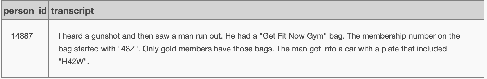
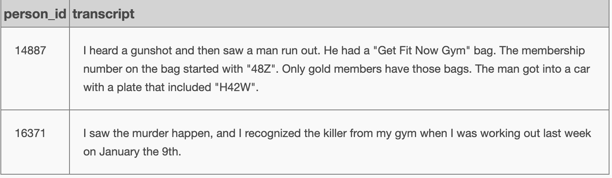

[HOME](../../README.md)

##  SQL Murder Mystery
SOURCE:  
https://mystery.knightlab.com/#experienced

#### 001 find the crime

```
-- 001 find the crime
select * from crime_scene_report
where type = 'murder' and city = 'SQL City' and date = 20180115
```


---

#### 002 find the witnesses
```
-- 002-1 find the first witness
select * from person where address_street_name = 'Northwestern Dr'
order by address_number desc
limit 1
```


```
-- 002-2 find the second witness
select * from person 
where name like 'Annabel%' and address_street_name = 'Franklin Ave'
```


---

#### 003 check witnesses statements
```
-- 003-1 check for any statement from first witness
select * from interview where person_id = 14887
```


```
-- 003-2 check for any statement from second witness
select * from interview where person_id = 16371
```


```
-- 003-0 combined
select * from interview
where person_id = 14887 or person_id = 16371
```


---

#### 004 find the suspect
```
-- 004-1 find suspect persons by gym membership
select *
from person p
join get_fit_now_member g on g.person_id = p.id
where g.id like '48Z%'
```


```
-- 004-2 find suspect persons by drivers license
select *
from drivers_license
where plate_number like '%H42W%'
```


```
select *
from get_fit_now_check_in
where check_in_date = 20180109 and membership_id like '48Z%'
```


```
-- 004-0 combined
-- So who is that person which checked in into gym on Janyary 9th 2018,
-- which has a gold membership and a car?
select p.*
from person p
join get_fit_now_member g
 on g.person_id = p.id and g.id like '48Z%' and g.membership_status = 'gold'
join get_fit_now_check_in c
 on c.membership_id = g.id and c.check_in_date = 20180109
join drivers_license d on d.id = p.license_id and d.plate_number like '%H42W%'
```


---

#### 005 check solution for the killer
```
-- 005 check solution
INSERT INTO solution VALUES (1, 'Jeremy Bowers');
        
SELECT value FROM solution;
```


---

#### 006 what did the killer said
```
-- 006 what did the killer said
select * from interview where person_id = 67318
```


---

#### 007 Okay, let's find out who ordered the killing
```
-- 007 who ordered the killing
with d_info as
(select *
	 from drivers_license
	 where
	 	gender = 'female'
	 	and height between 65 and 67
	 	and hair_color = 'red'
	 	and (car_make = 'Tesla' and car_model = 'Model S')
),
f_info as
(select *
 	from facebook_event_checkin
 	where
 		event_name = 'SQL Symphony Concert'
 		and date like '201712%'
)
select distinct p.*
from person p
join d_info d on d.id = p.license_id
join f_info f on f.person_id = p.id
```


---

#### 008 check solution for the killing orderer
```
INSERT INTO solution VALUES (1, 'Miranda Priestly');
        
SELECT value FROM solution;
```


### Congrats! I did it!

[HOME](../../README.md)